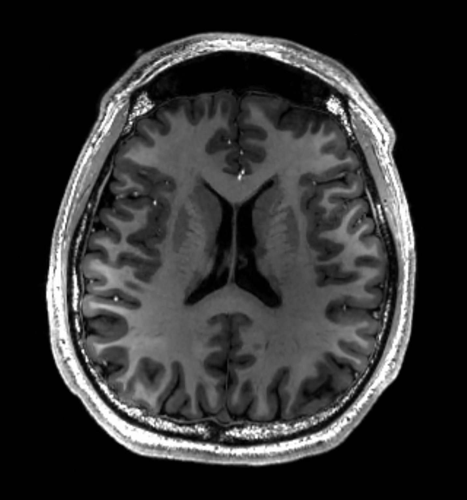

# 🧠 Multimodel Brain Tumor Detector

[](LICENSE) [](https://www.python.org/) [](https://www.tensorflow.org/) [](https://flask.palletsprojects.com/)

> A deep learning-based web app to classify brain tumors from MRI images using a trained multiclass CNN model.

## 🌟 Features
- 🧪 Multiclass tumor detection: **Glioma**, **Meningioma**, **Pituitary**, **No Tumor**
- 📤 Upload MRI scans and get **real-time predictions**
- 🧠 Trained deep learning model with `.h5` and label encoder support
- ⚡ Lightweight and interactive UI using **Flask**

## 🛠️ Tech Stack
- Python 3.9+
- Flask (backend web server)
- TensorFlow/Keras (deep learning)
- OpenCV, NumPy, scikit-learn
- HTML/CSS with Jinja2

## 🗂️ Project Structure
```
├── app.py
├── brain tumor multiclass model.h5
├── label_encoder.pkl
├── templates/           # HTML templates
├── static/              # CSS, JS, and image assets
├── uploads/             # Uploaded images
├── requirements.txt
└── README.md
```

## ⚙️ Setup Instructions
1. **Clone the repository**
```bash
git clone https://github.com/mmpbrother94/multimodel-brain-tumor-detector.git
cd multimodel-brain-tumor-detector
```

2. **Create a virtual environment**
```bash
python -m venv venv
venv\Scripts\activate          # On Windows
# or
source venv/bin/activate       # On Linux/Mac
```

3. **Install dependencies**
```bash
pip install -r requirements.txt
```

4. **Run the Flask app**
```bash
python app.py
```

```


## 🔍 Prediction Classes
| Label | Tumor Type   |
|-------|--------------|
| 0     | No Tumor     |
| 1     | Pituitary    |
| 2     | Meningioma   |
| 3     | Glioma       |


## 🙏 Acknowledgement
- Medical imaging datasets used for training the model.
- Open-source libraries and the deep learning community.

## 📜 License
This project is licensed under the MIT License - see the [LICENSE](LICENSE) file for details.
